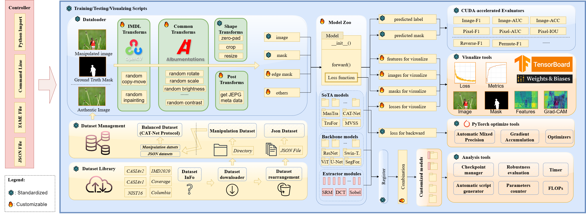

<p align="center" width="100%">

</p>

# [NeurIPS'24 Spotlight] IMDL-BenCo: Comprehensive Benchmark and Codebase for Image Manipulation Detection & Localization
<div align="center">

[Xiaochen Ma](https://ma.xiaochen.world/) †, Xuekang Zhu†, Lei Su†, Bo Du†, Zhuohang Jiang†, Bingkui Tong†,
Zeyu Lei†, Xinyu Yang†, Chi-Man Pun, Jiancheng Lv, [Jizhe Zhou](https://knightzjz.github.io/) *

</div>  
<div align="center"><span style="font-size: smaller;">
<br>†: joint first author & equal contribution
*: corresponding author</br>
🏎️Special thanks to Dr. <a href="https://cs.scu.edu.cn/info/1359/17839.htm">Wentao Feng</a> for the workplace, computation power, and physical infrastructure support.</span>    
</div>  

******
<!----
[](https://pytorch.org/) 
---->
[](https://arxiv.org/abs/2406.10580)
[](https://scu-zjz.github.io/IMDLBenCo-doc/)
[](https://pypistats.org/packages/imdlbenco)
[](https://pypi.org/project/IMDLBenCo/)


[](https://github.com/scu-zjz/IMDLBenCo/actions/workflows/tests.yml)
[
](https://app.codecov.io/github/scu-zjz/IMDLBenCo)
<!----
[](https://GitHub.com/scu-zjz/) 
---->

## News
- [2025/03/11] We have released pre-trained checkpoints on Baidu NetDisk that we utilized to report all metrics in the paper. Please see [this section](https://scu-zjz.github.io/IMDLBenCo-doc/guide/quickstart/2_load_ckpt.html#quick-testing-using-model-zoo-with-checkpoint) in our documents for details.
- [2024/12/10] [Mesorch](https://arxiv.org/pdf/2412.13753) [](https://github.com/scu-zjz/Mesorch), our new IML backbone model, which adopts a parallel CNN+Transformer structure to simultaneously deal with image semantics and non-semantics, is accepted by AAAI 25!!!🎉🎉🎉
   
- [2024/12/10] [Sparse-ViT](https://arxiv.org/pdf/2412.14598) [](https://github.com/scu-zjz/SparseViT), the very first solution of constructing the non-semantic feature extractor through a self-supervised manner in IML is proposed by us and accepted by AAAI 25!!!🎉🎉🎉
- [2024/09/26] This paper, IMDL-BenCo, has been accepted as **Spotlight** to NeurIPS 2024 Track Datasets and Benchmarks!!! 🎉🎉🎉

> [!IMPORTANT]
> **Upgrade to LATEST VERSION to Avoid Bugs!**
> - We **Highly Recommend** everyone update IMDLBenCo to the latest version `v0.1.29` since we fixed a bug🐞 that may lead to inaccurate image-level metrics!!! For details, see [IMDLBenCo v0.1.27 Release Notes](https://github.com/scu-zjz/IMDLBenCo/releases/tag/v0.1.27).
> 
> **Known Differences with original CAT-Net Protocol**
> 
> - The CAT-Protocol (implementation of default [balanced_dataset.py](https://github.com/scu-zjz/IMDLBenCo/blob/main/IMDLBenCo/statics/dataset_json/balanced_dataset.json)) used in the IMDLBenCo paper differs from the original [CAT-Net settings](https://github.com/mjkwon2021/CAT-Net/blob/main/Splicing/data/data_core.py). Several real image datasets are omitted. Please pay special attention! For more details, please check issue [#65](https://github.com/scu-zjz/IMDLBenCo/issues/65#issuecomment-2604861981).

## Overview
☑️**Welcome to IMDL-BenCo, the first comprehensive IMDL benchmark and modular codebase.**    
- This codebase is under long-term maintenance and updating. New features, extra baseline/SOTA models, and bug fixes will be continuously involved. You can find the corresponding plan here shortly.
- This repo decomposes the IMDL framework into **standardized, reusable components and revises the model construction pipeline**, improving coding efficiency and customization flexibility.
- This repo **fully implements or incorporates training code for state-of-the-art models** to establish a comprehensive IMDL benchmark.
- Cite and star if you feel helpful. This will encourage us a lot 🥰.   




## Quick Start
IMDL-BenCo is a Python library managed on PYPI now, It's easy to install by following the command:
```bash
pip install imdlbenco
```

To verify your installation, you can try the following commands: 
```bash
benco -v
```
Of course, the following command is also okay:
```bash
benco --version
```
This repository is under rapid development, thus, you can also use the command above to check if the current version is our latest version.

If everything works well, it should look like this:
```
IMDLBenCo codebase version: 0.1.23
        Checking for updates...
        Local version:  0.1.23
        PyPI newest version:  0.1.23
You are using the latest version: 0.1.23.
```
*****

For further guidance, please **click the buttons below** for official documentation:

[](https://scu-zjz.github.io/IMDLBenCo-doc/) [](https://scu-zjz.github.io/IMDLBenCo-doc/zh/)

[](https://scu-zjz.github.io/IMDLBenCo-doc/guide/quickstart/install.html) [](https://scu-zjz.github.io/IMDLBenCo-doc/zh/guide/quickstart/install.html)


We will keep updating the document with tricks and user cases. Please stay tuned!

We also welcome contributors to translate it into other languages.

## Awesome Works Using IMDLBenCo
- [OpenSDI](https://iamwangyabin.github.io/OpenSDI/): A large dataset for Spotting Diffusion-Generated Images in the Open World and a corresponding SoTA model. CVPR25. [](https://github.com/iamwangyabin/OpenSDI)
- [Sparse-ViT](https://arxiv.org/abs/2412.14598): A SoTA model constructing the non-semantic feature extractor through a sparse-designed attention transformer. AAAI'25. [](https://github.com/scu-zjz/SparseViT)
- [Mesorch](https://arxiv.org/abs/2412.13753): A SoTA model adopts a parallel CNN+Transformer structure to simultaneously deal with image semantics and non-semantics. AAAI'25. [](https://github.com/scu-zjz/Mesorch)
- [IML-ViT](https://arxiv.org/abs/2307.14863): A pure Vision Transformer based model for IML task, which easy to be extent for further research. ArXiv. [](https://github.com/sunnyhaze/iml-vit)


## About
☑️**About the Developers:**  
- IMDL-BenCo's project leader/supervisor is Associate Professor 🏀[_Jizhe Zhou_ (周吉喆)](https://knightzjz.github.io/), Sichuan University🇨🇳.  
- IMDL-BenCo's codebase designer and coding leader is the Research Assistant [_Xiaochen Ma_ (马晓晨)](https://me.xiaochen.world/), Sichuan University🇨🇳.  
- IMDL-BenCo is jointly sponsored and advised by Prof. _Jiancheng LV_ (吕建成), Sichuan University 🐼, and Prof. _Chi-Man PUN_ (潘治文), University of Macau 🇲🇴, through the [Research Center of Machine Learning and Industry Intelligence, China MOE](https://center.dicalab.cn/) platform.  

## Citation
If you find our work valuable and it has contributed to your research or projects, we kindly request that you cite our paper. Your recognition is a driving force for our continuous improvement and innovation🤗.
```
@article{ma2025imdl,
  title={Imdl-benco: A comprehensive benchmark and codebase for image manipulation detection \& localization},
  author={Ma, Xiaochen and Zhu, Xuekang and Su, Lei and Du, Bo and Jiang, Zhuohang and Tong, Bingkui and Lei, Zeyu and Yang, Xinyu and Pun, Chi-Man and Lv, Jiancheng and others},
  journal={Advances in Neural Information Processing Systems},
  volume={37},
  pages={134591--134613},
  year={2025}
}
```

**************
## Statistics and Star History
<div align="center">

<a href="https://star-history.com/#scu-zjz/IMDLBenCo&Date">
 <picture>
   <source media="(prefers-color-scheme: dark)" srcset="https://api.star-history.com/svg?repos=scu-zjz/IMDLBenCo&type=Date&theme=dark" />
   <source media="(prefers-color-scheme: light)" srcset="https://api.star-history.com/svg?repos=scu-zjz/IMDLBenCo&type=Date" />
   
 </picture>
</a>

<a href="https://info.flagcounter.com/H5vw"></a></div>
